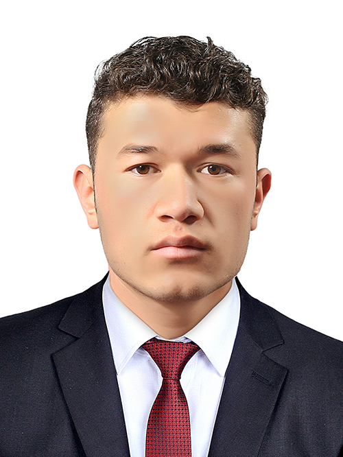

# Hi there, I'm [Najibullah Jafari]()

  
  <h2 style="font-family: 'Bungee', cursive; font-size: 50px; color: #fff; text-align: center; text-shadow: 0px 0px 10px #fff, 0px 0px 20px #fff, 0px 0px 30px #fff, 0px 0px 40px #ff00de, 0px 0px 70px #ff00de, 0px 0px 80px #ff00de, 0px 0px 100px #ff00de;"></h2>

 

  
  

 
<!--  
- ](https://github.com/najibullahjafari/github-readme-activity-graph)
 
I'm a passionate Software developer who loves coding and building projects.
 
- 
 
- 
 
-->
## 🔭 My current projects:

- [Project 1](https://github.com/najibullahjafari/Portfolio-Mobile_version)

## 🌱 I'm currently learning:

- [Microverse](https://www.microverse.org/)
- [Free code camp](https://forum.freecodecamp.org/)
- [Mozilla Developer](https://developer.mozilla.org/en-US/)

## 💬 Ask me about:

- Anything related to HTML, CSS, PYTHON, PROBLEM SOLVING
- Playing soccer, Chess, Biking 
- Vs code, Pycharm, Git

## 📫 How to reach me:

- [Email](najib2020202020@gmail.com)
- 
- [Codeforces](https://codeforces.com/profile/kucoders)
- [HackerRank](https://www.hackerrank.com/najib2020202020)

## 😄 Pronouns:

- [He/Him]

## ⚡ Fun fact:

- I like problem solving
